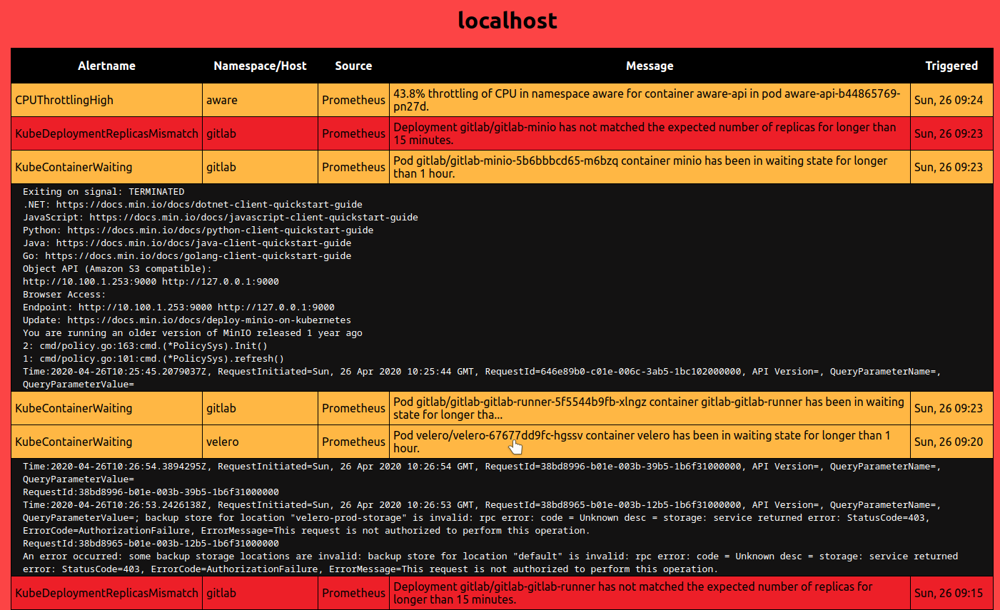

# Aware - A highly visual system agnostic alerting dashboard

The purpose of this dashboard is to have it be more alarming and visual compared to e.g. the Prometheus Alerts page. You would typically set this dashboard up on a team-monitor and in the case of an event, get everyones attention, and then inspect further in another dashboard with more features.

## Demo

When there are no events:  


In the case of events and integrated with a log provider:  

The background change color to the most severe event.

## API Endpoints

The API exposes two endpoints (`/api/events`, and `/api/exports`).

### /api/events GET

Returns a list of alerts sorted on time first triggered. Aggregated from all configured alerting API's. (Currently suppport Sensu Go-^5.17 and Prometheus ^2.15 )

### /api/exports GET

Meant to be used when you have a protected network(Kubernetes cluster), where createing Auth mechanisms for the alerting backends are troublesome. You can then deploy Aware-API inside the LAN and have it gather events from the unprotected api's, and export them from this endpoint.

Returns the same list as from `/api/events`, but rewrites the "source" tag to the ENV_VAR DEPLOYMENT_NAME.

This endpoint is also protected with a very basic API-Key mechanism.

#### Authorization

``` sh
GET /api/exports
Headers: AUTHORIZATION: Key MyVerySecretKey
```

## Usage

The easiest way to test and/or use this dashboard is with Docker(-compose).  
All configuration is loaded from environment variabled.

* DEPLOYMENT_NAME:  
   Value that will be used as "source" on exported alerts
* PROMETHEUS_API  
The full URL to the Prometheus API to gather alerts from.  
(e.g. http://prometheus-operator-prometheus.monitoring:9090/api/v1/alerts;  Here it points to a Kubernetes service in the 'monitoring' namespace.)
* SENSU_API:  
  The full url to a Sensu Go api
* IMPORT_URLS:  
  A string with several ";" separated URL's to import Aware-API standard alerts from.
* SENSU_KEY:  
The API-Key to the configured Sensu backend.  
* EXPORT_SECRET:  
  The key that clients will need to provide to Authenticate with the `/api/exports` endpoint.
* IGNORE_PROMETHEUS_ALERTS:  
  A string with several ";" separated Prometheus AlertNames to be ignored.

## Front end

Pretty simple stuff.  
Changes background color based on "most sever alert".  
Refetches all alerts every 30 seconds.

## Limitations

* Only supports one of each Sensu and Prometheus backends.
* Only one export api-key.
