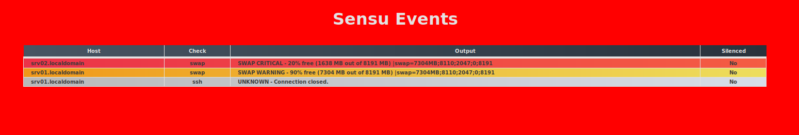

# Aware - A highly visual Prometheus alerts dashboard

The purpose of this dashboard is to have it be more alarming and visual compared to e.g. the Prometheus Alerts page. You would typically set this dashboard up on a team-monitor and in the case of an event, get everyones attention, and then inspect further in another dashboard with more features.

## Demo
(Outdated!: But basically the same, just with Prometheus and not Sensu)  
In the case of events:

The background change color to the most severe event.

When there are no events:


## Usage

The easiest way to test and/or use this dashboard is with Docker. Edit docker-compose.yaml to configure the following settings:

* REFRESH_INTERVAL  
How often the html page should reload and poll the API.
* PROMETHEUS_API  
The full path to the Prometheus API.  
(e.g. http://prometheus-operator-prometheus.monitoring:9090/api/v1/alerts;  Here it points to a Kubernetes service in the 'monitoring' namespace.)
* DASHBOARD_HEADER  
The string you want to replace 'Sensu Events' with in the screenshots.
* IGNORE_ALERTS  
A comma separated string of the names of Prometheus alerts that should be ignored.

Start the application with docker-compose
```
docker-compose up -d
```
Or deploy it to your Kubernetes cluster after tweaking the example manifests.
```
kubectl apply -f ./k8s-manifests/
```

